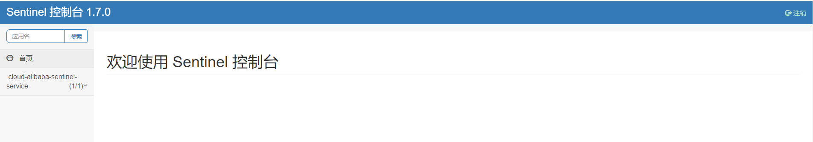
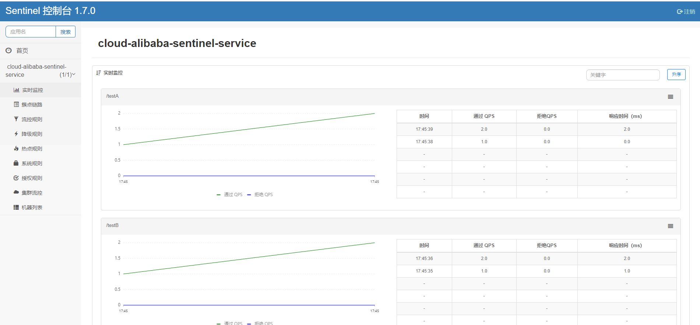
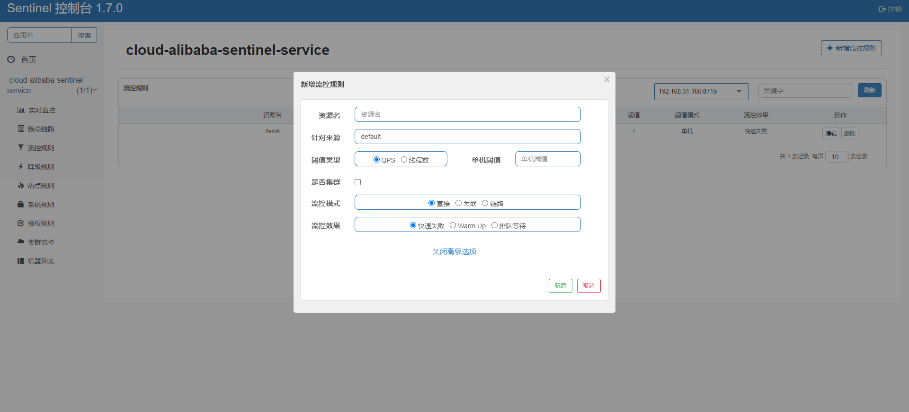
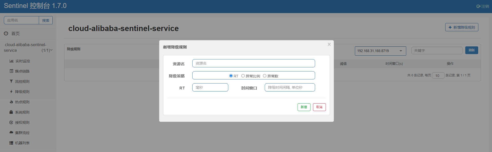
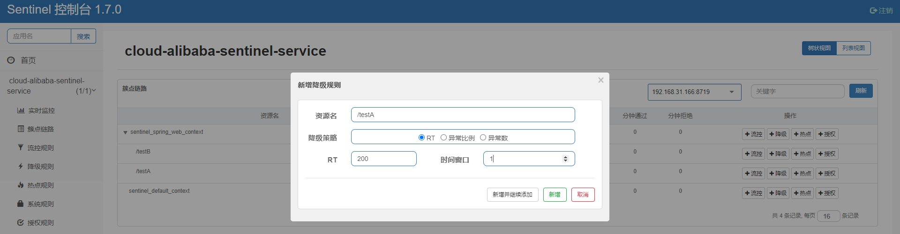
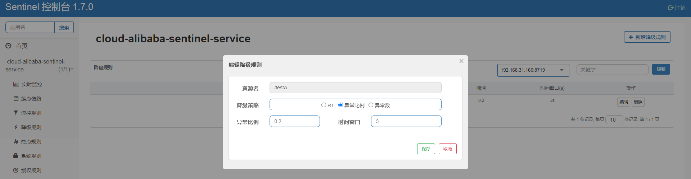
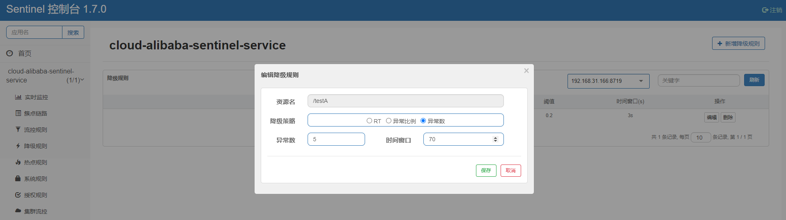

##### 1. Sentinel安装

- 下载地址：https://github.com/alibaba/Sentinel/releases

- 运行方式：java -jar

- 访问地址：http://127.0.0.1:10010/#/login   **端口号：默认8080**

- 账号/密码：sentinel/sentinel

- 界面展示

  

##### 2. 服务入驻Sentinel

- 引入依赖

  ~~~xml
  <!-- alibaba nacos -->
  <dependency>
      <groupId>com.alibaba.cloud</groupId>
      <artifactId>spring-cloud-starter-alibaba-nacos-discovery</artifactId>
  </dependency>
  <!-- sentinel -->
  <dependency>
      <groupId>com.alibaba.cloud</groupId>
      <artifactId>spring-cloud-starter-alibaba-sentinel</artifactId>
  </dependency>
  <!-- sentinel-datasource-nacos 持久化 -->
  <dependency>
      <groupId>com.alibaba.csp</groupId>
      <artifactId>sentinel-datasource-nacos</artifactId>
  </dependency>
  <!-- openfeign -->
  <dependency>
      <groupId>org.springframework.cloud</groupId>
      <artifactId>spring-cloud-starter-openfeign</artifactId>
  </dependency>
  <!-- web -->
  <dependency>
      <groupId>org.springframework.boot</groupId>
      <artifactId>spring-boot-starter-web</artifactId>
  </dependency>
  <!-- 监控 -->
  <dependency>
      <groupId>org.springframework.boot</groupId>
      <artifactId>spring-boot-starter-actuator</artifactId>
  </dependency>
  <dependency>
      <groupId>com.lemonzuo</groupId>
      <artifactId>cloud-api-common</artifactId>
  </dependency>
  ~~~

- yml配置

  ~~~yml
  server:
    port: 8401
  
  spring:
    application:
      name: cloud-alibaba-sentinel-service
    cloud:
      nacos:
        discovery:
          # nacos注册中心地址
          server-addr: 47.98.35.82:10000
      sentinel:
        transport:
          # sentinel dashboard 地址
          dashboard: 127.0.0.1:10010
          # 默认8719，若被占用会一次+1扫描寻到到未被占用端口
          port: 8719
  
  management:
    endpoints:
      web:
        exposure:
          include: '*'
  ~~~

- 主启动类

  ~~~java
  @SpringBootApplication
  @EnableDiscoveryClient
  public class SentinelServiceApplication {
      public static void main(String[] args) {
          SpringApplication.run(SentinelServiceApplication.class, args);
      }
  }
  ~~~

- 业务类

  ~~~java
  @RestController
  public class FlowLimitController {
      @GetMapping("/testA")
      public String testA() {
          return "testA";
      }
  
      @GetMapping("/testB")
      public String testB() {
          return "testB";
      }
  }
  ~~~

- 注意事项

  - sentinel默认懒加载，发生请求后进行监管

  - 实时流量监控

    

##### 3. Sentinel流量控制

1. 管理界面

   

2. 规则

   - 资源名：唯一名称，默认为请求路径

   - 针对来源：Sentinel可以针对调用者进行限流，填写微服务名，默认default（不区分来源）

   - 阈值类型/单机阈值

     - QPS(每秒的请求数量)：当调用api达到QPS的阈值时进行限流

     - 线程数：当调用api的线程数达到阈值时进行限流

   - 是否集群：不需要集群

   - 流控模式

     - 直接：api达到限流条件时，直接限流

     - 关联：当关联的资源达到阈值时，限流自己

     - 链路：只记录指定链路上的流量（指定资源入口进来的流量，如果达到阈值，就进行限流）【api级别的针对来源】

   - 流控效果

     - 快速失败：直接失败，抛出异常

     - Warm Up:根据codeFactor（冷加载因子，默认3）的值，从阈值/codeFactor，经过预热时长，才达到设置的QPS值

##### 4. Sentinel熔断降级

1. 管理界面

   

2. 降级策略

   - RT（平均响应时间，秒级）

     平均响应时间超出阀值且在时间窗口内通过的请求 >=5 ,两个条件同时满足触发降级，窗口期过后关闭断路器

     RT最大4900（更大的需通过-Dscp.sentinel.static.max.rt=XXXX才能生效）

   - 异常比例（秒级）

     QPS>=5 且异常比例（秒级统计）超过阀值时，触发降级；时间窗口结束后，关闭降级

   - 异常数（分钟级）

     异常数（分钟统计）超出阀值时，触发降级；时间窗口结束后，关闭降级

3. 样例

   - RT

     

     **1秒内请求数大于等于5次，若平均响应时间大于200毫秒，在下1秒内对/testA作服务降级，下1秒后，恢复/testA服务** 

   - 异常比例数

     

     **1秒内请求数大于5次，若异常比例大于20%，在接下来3秒内对/testA作服务降级，3秒结束后恢复testA服务（若每秒请求数小于5次立即恢复服务，若请每秒请求数大于5次需3秒后恢复）**

   - 异常数

     

     **每分钟内请求数大于5次，若异常数大于5次，接下来70秒内对/testA左服务降级，70秒结束后恢复/testA服务**

