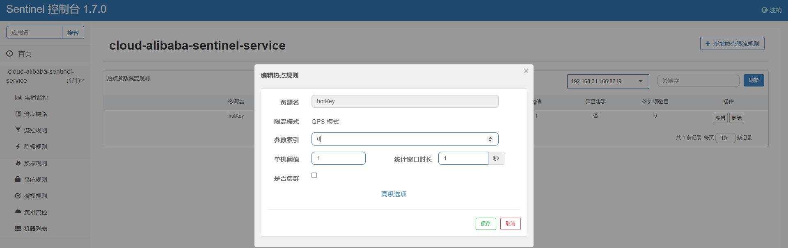
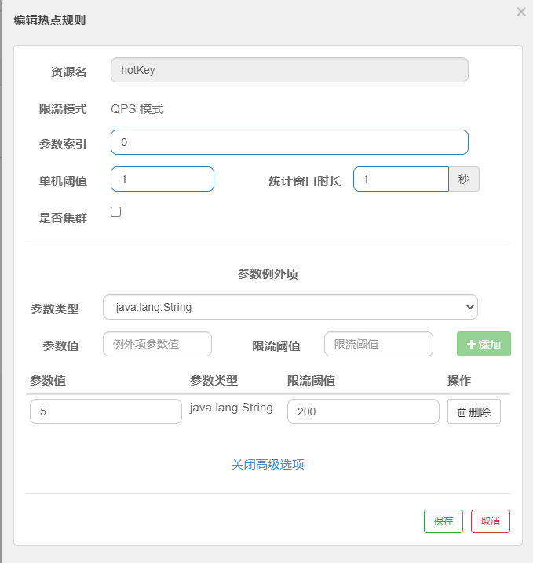
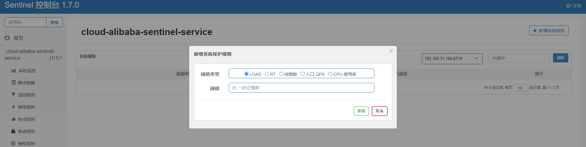
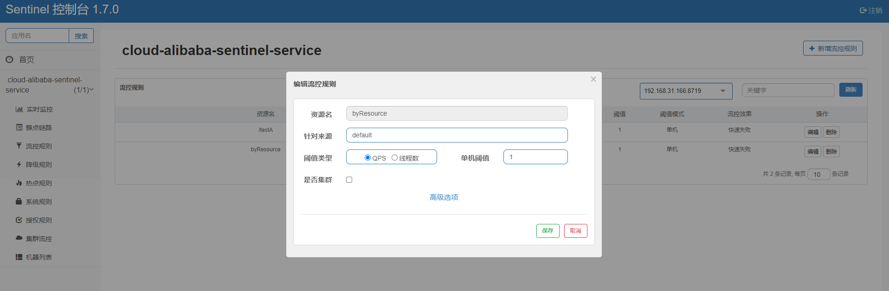
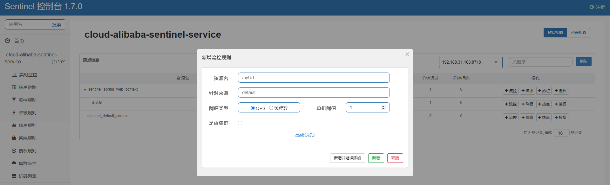

##### 1. Sentinel安装

- 下载地址：https://github.com/alibaba/Sentinel/releases

- 运行方式：java -jar

- 访问地址：http://127.0.0.1:10010/#/login   **端口号：默认8080**

- 账号/密码：sentinel/sentinel

- 界面展示

  

##### 2. 服务入驻Sentinel

- 引入依赖

  ~~~xml
  <!-- alibaba nacos -->
  <dependency>
      <groupId>com.alibaba.cloud</groupId>
      <artifactId>spring-cloud-starter-alibaba-nacos-discovery</artifactId>
  </dependency>
  <!-- sentinel -->
  <dependency>
      <groupId>com.alibaba.cloud</groupId>
      <artifactId>spring-cloud-starter-alibaba-sentinel</artifactId>
  </dependency>
  <!-- sentinel-datasource-nacos 持久化 -->
  <dependency>
      <groupId>com.alibaba.csp</groupId>
      <artifactId>sentinel-datasource-nacos</artifactId>
  </dependency>
  <!-- openfeign -->
  <dependency>
      <groupId>org.springframework.cloud</groupId>
      <artifactId>spring-cloud-starter-openfeign</artifactId>
  </dependency>
  <!-- web -->
  <dependency>
      <groupId>org.springframework.boot</groupId>
      <artifactId>spring-boot-starter-web</artifactId>
  </dependency>
  <!-- 监控 -->
  <dependency>
      <groupId>org.springframework.boot</groupId>
      <artifactId>spring-boot-starter-actuator</artifactId>
  </dependency>
  <dependency>
      <groupId>com.lemonzuo</groupId>
      <artifactId>cloud-api-common</artifactId>
  </dependency>
  ~~~

- yml配置

  ~~~yml
  server:
    port: 8401
  
  spring:
    application:
      name: cloud-alibaba-sentinel-service
    cloud:
      nacos:
        discovery:
          # nacos注册中心地址
          server-addr: 47.98.35.82:10000
      sentinel:
        transport:
          # sentinel dashboard 地址
          dashboard: 127.0.0.1:10010
          # 默认8719，若被占用会一次+1扫描寻到到未被占用端口
          port: 8719
  
  management:
    endpoints:
      web:
        exposure:
          include: '*'
  ~~~

- 主启动类

  ~~~java
  @SpringBootApplication
  @EnableDiscoveryClient
  public class SentinelServiceApplication {
      public static void main(String[] args) {
          SpringApplication.run(SentinelServiceApplication.class, args);
      }
  }
  ~~~

- 业务类

  ~~~java
  @RestController
  public class FlowLimitController {
      @GetMapping("/testA")
      public String testA() {
          return "testA";
      }
  
      @GetMapping("/testB")
      public String testB() {
          return "testB";
      }
  }
  ~~~

- 注意事项

  - sentinel默认懒加载，发生请求后进行监管

  - 实时流量监控

    

##### 3. Sentinel流量控制

1. 管理界面

   

2. 流量控制规则

   - 资源名：唯一名称，默认为请求路径

   - 针对来源：Sentinel可以针对调用者进行限流，填写微服务名，默认default（不区分来源）

   - 阈值类型/单机阈值

     - QPS(每秒的请求数量)：当调用api达到QPS的阈值时进行限流

     - 线程数：当调用api的线程数达到阈值时进行限流

   - 是否集群：不需要集群

   - 流控模式

     - 直接：api达到限流条件时，直接限流

     - 关联：当关联的资源达到阈值时，限流自己

     - 链路：只记录指定链路上的流量（指定资源入口进来的流量，如果达到阈值，就进行限流）【api级别的针对来源】

   - 流控效果

     - 快速失败：直接失败，抛出异常

     - Warm Up:根据codeFactor（冷加载因子，默认3）的值，从阈值/codeFactor，经过预热时长，才达到设置的QPS值

##### 4. Sentinel服务降级

1. 管理界面

   

2. 降级策略

   - RT（平均响应时间，秒级）

     平均响应时间超出阀值且在时间窗口内通过的请求 >=5 ,两个条件同时满足触发降级，窗口期过后关闭断路器

     RT最大4900（更大的需通过-Dscp.sentinel.static.max.rt=XXXX才能生效）

   - 异常比例（秒级）

     QPS>=5 且异常比例（秒级统计）超过阀值时，触发降级；时间窗口结束后，关闭降级

   - 异常数（分钟级）

     异常数（分钟统计）超出阀值时，触发降级；时间窗口结束后，关闭降级

3. 样例

   - RT

     

     **1秒内请求数大于等于5次，若平均响应时间大于200毫秒，在下1秒内对/testA作服务降级，下1秒后，恢复/testA服务** 

   - 异常比例数

     

     **1秒内请求数大于5次，若异常比例大于20%，在接下来3秒内对/testA作服务降级，3秒结束后恢复testA服务（若每秒请求数小于5次立即恢复服务，若请每秒请求数大于5次需3秒后恢复）**

   - 异常数

     

     **每分钟内请求数大于5次，若异常数大于5次，接下来70秒内对/testA左服务降级，70秒结束后恢复/testA服务**

##### 5. 热点规则

1. 管理界面

   

2. 业务类

   ~~~java
   @RestController
   public class FlowLimitController {
   
       @GetMapping("/hotKey")
       @SentinelResource(value = "hotKey", blockHandler = "dealHotKey")
       public String hotKey(@RequestParam(value = "p1", required = false) String p1,
                            @RequestParam(value = "p1", required = false) String p2) {
           return "====hot key====";
       }
   
       /**
        * 降级处理方法
        * @param p1
        * @param p2
        * @param exception
        * @return
        */
       public String dealHotKey(String p1, String p2, BlockException exception) {
           return "====dealHotKey====";
       }
   }
   ~~~

   **@SentinelResource**

   - value:资源名
   - blockHandler:降级处理方法

3. 参数例外项

   - 配置界面

     

   - 配置解释

     对资源名为hotKey的第0个参数在1秒内当QPS>1进行限流降级，例外的是，若第0个参数值为5时其每秒内QPS值超过200才进行限流

4. 特殊情况

   若方法内产生异常情况，**@SentinelResource**降级限流失效。

##### 6.Sentinel系统规则

系统自适应限流： Sentinel 系统自适应限流从整体维度对应用入口流量进行控制

- **Load 自适应**（仅对 Linux/Unix-like 机器生效）：系统的 load1 作为启发指标，进行自适应系统保护。当系统 load1 超过设定的启发值，且系统当前的并发线程数超过估算的系统容量时才会触发系统保护（BBR 阶段）。系统容量由系统的 `maxQps * minRt` 估算得出。设定参考值一般是 `CPU cores * 2.5`。
- **CPU usage**（1.5.0+ 版本）：当系统 CPU 使用率超过阈值即触发系统保护（取值范围 0.0-1.0），比较灵敏。
- **平均 RT**：当单台机器上所有入口流量的平均 RT 达到阈值即触发系统保护，单位是毫秒。
- **并发线程数**：当单台机器上所有入口流量的并发线程数达到阈值即触发系统保护。
- **入口 QPS**：当单台机器上所有入口流量的 QPS 达到阈值即触发系统保护

配置界面：

##### 7.@SentinelResource

- 按资源名称限流

  - 业务类

    ~~~java
    @RestController
    public class RateLimitController {
        @GetMapping("/byResource")
        @SentinelResource(value = "byResource", blockHandler = "handleException")
        public CommonResult byResource() {
            CommonResult result = new CommonResult(200, "按资源名称限流测试", new Payment(2020L, "SERIAL001"));
            return result;
        }
    
        public CommonResult handleException(BlockException exception) {
            CommonResult result = new CommonResult(444, exception.getClass().getCanonicalName(), "服务不可用");
            return result;
        }
    }
    ~~~

  - 限流配置

    

- 按URL限流

  - 业务类

    ~~~java
    @RestController
    public class RateLimitController {
        @GetMapping("/byUrl")
        public CommonResult byUrl() {
            CommonResult result = new CommonResult(200, "按URL限流测试", new Payment(2021L, "SERIAL002"));
            return result;
        }
    }
    ~~~

  - 限流配置

    

- 自定义BlockHandle

  - BlockHandle类

    ~~~java
    public class CustomerBlockHandler {
        public static CommonResult masterHandleException(BlockException exception) {
            CommonResult result = new CommonResult(444,
                    "按客户自定义，GlobalException---->master",
                    exception.getClass().getCanonicalName());
            return result;
        }
    
        public static CommonResult slaverHandleException(BlockException exception) {
            CommonResult result = new CommonResult(444,
                    "按客户自定义，GlobalException---->slaver",
                    exception.getClass().getCanonicalName());
            return result;
        }
    }
    ~~~

    BlockHandle不支持private方法

  - 业务类

    ~~~java
    @RestController
    public class RateLimitController {
        @GetMapping("/masterCustomerHandle")
        @SentinelResource(value = "masterCustomerHandle",
                blockHandlerClass = CustomerBlockHandler.class,
                blockHandler = "masterHandleException")
        public CommonResult customerHandle() {
            CommonResult result = new CommonResult(200, "用户自定义", new Payment(2021L, "SERIAL003"));
            return result;
        }
    
        @GetMapping("/slaverCustomerHandle")
        @SentinelResource(value = "slaverCustomerHandle",
                blockHandlerClass = CustomerBlockHandler.class,
                blockHandler = "slaverHandleException")
        public CommonResult slaverHandle() {
            CommonResult result = new CommonResult(200, "用户自定义", new Payment(2021L, "SERIAL004"));
            return result;
        }
    }
    ~~~

    @SentinelResource

    - value:资源名称
    - blockHandlerClass：处理类
    - blockHandler：处理方法名

##### 8.Sentinel服务熔断

###### 1）Sentinel服务熔断blockHandler、fallback

|                    | 发生异常         | 触发限流             |
| ------------------ | ---------------- | -------------------- |
| 只配置blockHandler | 程序报错         | 执行blockHandler方法 |
| 只配置fallback     | 执行fallback方法 | 执行fallback方法     |
| 同时配置           | 执行fallback方法 | 执行blockHandler方法 |

业务类源码

~~~java
@Slf4j
@RestController
public class OrderNacosController {
    @Resource
    private RestTemplate restTemplate;

    @Value("${service-url.nacos-user-service}")
    private String serviceUrl;

    @GetMapping("consumer/payment/get/{id}")
    @SentinelResource(value = "getPayment", blockHandler = "handle", fallback = "fallBack")
    public CommonResult getPayment(@PathVariable(name = "id") Long id) {
        CommonResult result = restTemplate.getForObject(serviceUrl + "/payment/get/" + id, CommonResult.class);
        if (id == 4) {
            throw new IllegalArgumentException("参数非法异常");
        } else if (result.getData() == null) {
            throw new NullPointerException("ID对应记录为空");
        }
        return result;
    }

    public CommonResult fallBack(@PathVariable(name = "id")Long id, Throwable throwable) {
        Payment payment = new Payment(id, null);
        CommonResult result = new CommonResult(444, "fallBack:" + throwable.getMessage(), payment);
        return result;
    }

    public CommonResult handle(@PathVariable(name = "id")Long id, BlockException exception) {
        Payment payment = new Payment(id, null);
        CommonResult result = new CommonResult(444, "handle:" + exception.getMessage(), payment);
        return result;
    }
}
~~~

###### 2）Sentinel服务熔断exceptionsToIgnore

配置exceptionsToIgnore属性后，触发对应异常不再执行fallBack方法，触发流控时handle正常执行。

业务类

~~~java
@Slf4j
@RestController
public class OrderNacosController {
    @Resource
    private RestTemplate restTemplate;

    @Value("${service-url.nacos-user-service}")
    private String serviceUrl;

    @GetMapping("consumer/payment/get/{id}")
    @SentinelResource(value = "getPayment",
            blockHandler = "handle",
            fallback = "fallBack",
            exceptionsToIgnore = IllegalArgumentException.class)
    public CommonResult getPayment(@PathVariable(name = "id") Long id) {
        CommonResult result = restTemplate.getForObject(serviceUrl + "/payment/get/" + id, CommonResult.class);
        if (id == 4) {
            throw new IllegalArgumentException("参数非法异常");
        } else if (result.getData() == null) {
            throw new NullPointerException("ID对应记录为空");
        }
        return result;
    }

    public CommonResult fallBack(@PathVariable(name = "id")Long id, Throwable throwable) {
        Payment payment = new Payment(id, null);
        CommonResult result = new CommonResult(444, "fallBack:" + throwable.getMessage(), payment);
        return result;
    }

    public CommonResult handle(@PathVariable(name = "id")Long id, BlockException exception) {
        Payment payment = new Payment(id, null);
        CommonResult result = new CommonResult(444, "handle:" + exception.getMessage(), payment);
        return result;
    }
}
~~~

