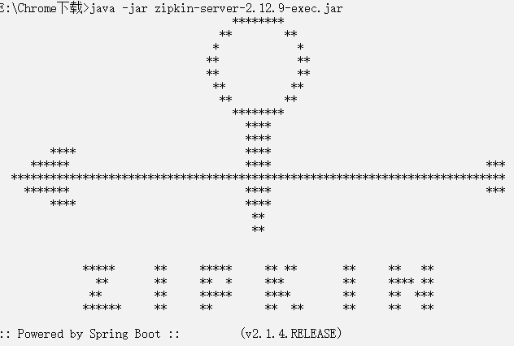
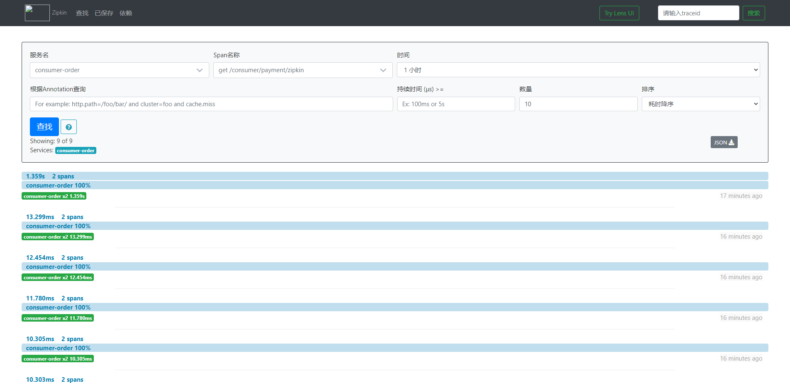

1. 安装zipkin

   - 下载地址：http://dl.bintray.com/openzipkin/maven/io/zipkin/java/zipkin-server/

   - zipkin运行：java -jar 方式运行jar包

     

   - 监控地址：http://127.0.0.1:9411/zipkin/

2. 引入依赖

   ~~~xml
   <dependency>
       <groupId>org.springframework.cloud</groupId>
       <artifactId>spring-cloud-starter-zipkin</artifactId>
   </dependency>
   ~~~

3. yml配置

   ~~~yml
   spring:
     zipkin:
       base-url: http//:127.0.0.1:9411 #zipkin 监控地址
       sleuth:
         sampler:
           # 采样率介于0到1之间，1表示全部采集
           probability: 1
   ~~~

4. 监控展示：

