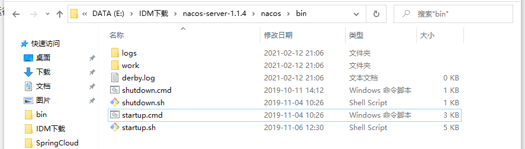
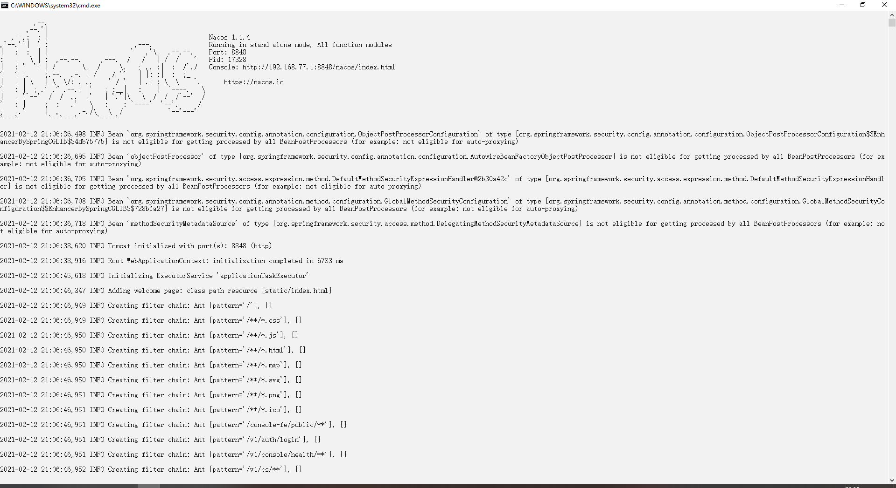
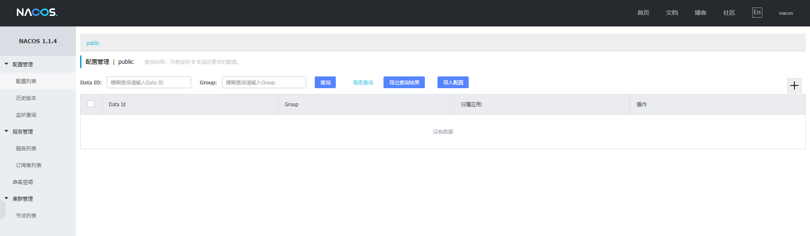
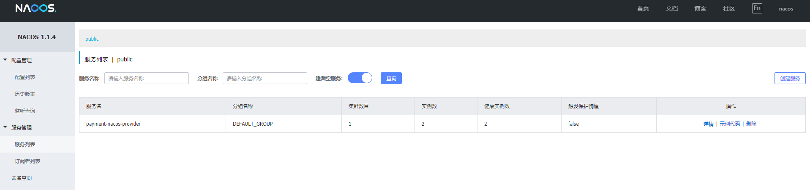
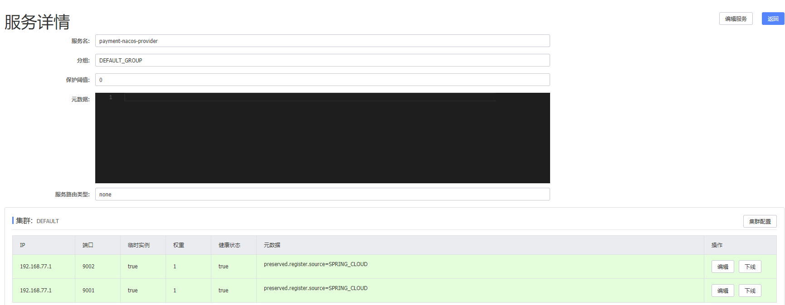
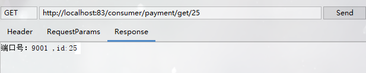
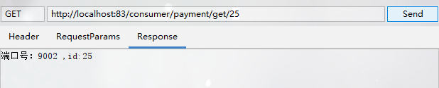

##### 1.基本概念

作用：替代Eureka做服务注册中心、替代Config做服务配置中心

##### 2. nacos安装

- 下载地址：https://github.com/alibaba/nacos/releases

- 运行方式：cmd脚本运行

  

  

- nacos管理控制台

  - 管理地址：http://192.168.77.1:8848/nacos/

  - 用户名/密码：nacos/nacos

  - 管理界面

    

##### 3.基于Nacos服务提供者

- 引入依赖

  ~~~xml
  <!-- alibaba nacos -->
  <dependency>
      <groupId>com.alibaba.cloud</groupId>
      <artifactId>spring-cloud-starter-alibaba-nacos-discovery</artifactId>
  </dependency>
  <dependency>
      <groupId>org.springframework.boot</groupId>
      <artifactId>spring-boot-starter-web</artifactId>
  </dependency>
  <dependency>
      <groupId>org.springframework.boot</groupId>
      <artifactId>spring-boot-starter-actuator</artifactId>
  </dependency>
  ~~~

- yml配置

  ~~~yml
  server:
    port: 9001
  spring:
    application:
      name: payment-nacos-provider
    cloud:
      nacos:
        discovery:
          server-addr: 127.0.0.1:8848 # nacos服务地址
  management:
    endpoints:
      web:
        exposure:
          include: "*"
  ~~~

- 主启动类

  ~~~java
  @SpringBootApplication
  @EnableDiscoveryClient
  public class PaymentNacosProviderApplication {
      public static void main(String[] args) {
          SpringApplication.run(PaymentNacosProviderApplication.class, args);
      }
  }
  ~~~

  **重点：@EnableDiscoveryClient**

- 业务类

  ~~~java
  @RestController
  public class PaymentController {
      @Value("${server.port}")
      private String port;
  
      @GetMapping("/payment/get/{id}")
      public String getPaymentById(@PathVariable Long id) {
          StringBuffer result = new StringBuffer("端口号：")
                  .append(port)
                  .append(" ,id:")
                  .append(id);
          return result.toString();
      }
  }
  ~~~

- nacos监控展示

  

  

##### 4.基于Nacos服务消费者

- 引入依赖

  ~~~xml
  <!-- alibaba nacos -->
  <dependency>
      <groupId>com.alibaba.cloud</groupId>
      <artifactId>spring-cloud-starter-alibaba-nacos-discovery</artifactId>
  </dependency>
  <dependency>
      <groupId>org.springframework.boot</groupId>
      <artifactId>spring-boot-starter-web</artifactId>
  </dependency>
  <dependency>
      <groupId>org.springframework.boot</groupId>
      <artifactId>spring-boot-starter-actuator</artifactId>
  </dependency>
  ~~~

- yml配置

  ~~~yml
  server:
    port: 83
  spring:
    application:
      name: order-nacos-consumer
    cloud:
      nacos:
        discovery:
          server-addr: 127.0.0.1:8848 # nacos服务地址
  # 需要访问的服务提供者地址
  service-url:
    nacos-user-service: http://payment-nacos-provider
  ~~~

- 主启动类

  ~~~java
  @SpringBootApplication
  @EnableDiscoveryClient
  public class OrderNacosConsumerApplication {
      public static void main(String[] args) {
          SpringApplication.run(OrderNacosConsumerApplication.class, args);
      }
  }
  ~~~

  **重点：@EnableDiscoveryClient**

- RestTemplate配置类

  ~~~java
  @Configuration
  public class RestTemplateConfig {
      @Bean
      @LoadBalanced
      public RestTemplate getRestTemplate() {
          RestTemplate template = new RestTemplate();
          return template;
      }
  }
  ~~~

- 业务类

  ~~~java
  @Slf4j
  @RestController
  public class OrderNacosController {
      @Resource
      private RestTemplate restTemplate;
  
      @Value("${service-url.nacos-user-service}")
      private String serviceUrl;
  
      @GetMapping("consumer/payment/get/{id}")
      public String echo(@PathVariable(name = "id") String id) {
          String result = restTemplate.getForObject(serviceUrl + "/payment/get/" + id, String.class);
          return result;
      }
  }
  ~~~

- 调用效果

  

##### 5.注册服务中心对比

| 注册服务框架 | CAP模型 | 控制台管理 | 社区活跃度 |
| ------------ | ------- | ---------- | ---------- |
| Eureka       | AP      | 支持       | 低         |
| Zookeeper    | CP      | 不支持     | 中         |
| Consul       | CP      | 支持       | 高         |
| Nacos        | AP      | 支持       | 高         |

