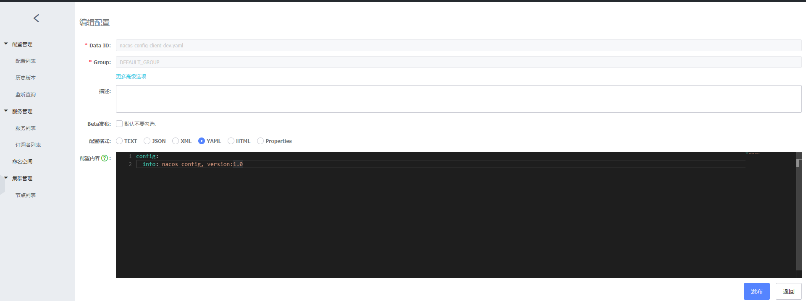
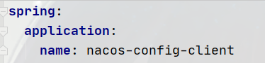
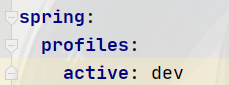
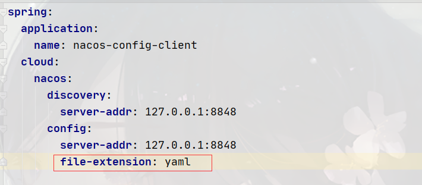
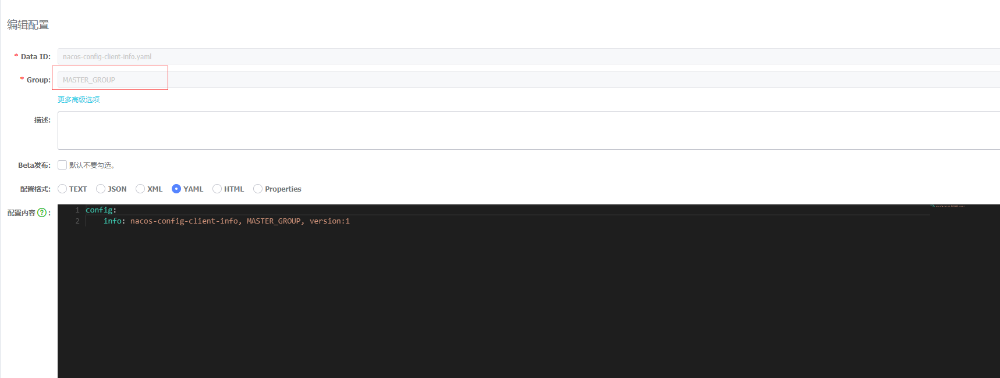
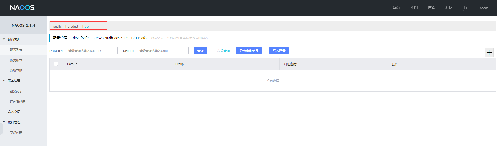
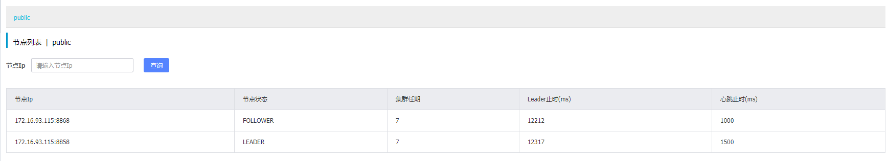

##### 1. 基于Nacos服务配置中心

- 引入依赖

  ~~~xml
  <dependency>
      <groupId>com.alibaba.cloud</groupId>
      <artifactId>spring-cloud-starter-alibaba-nacos-config</artifactId>
  </dependency>
  ~~~

- yml配置

  - bootstrap.yml

    ~~~yml
    spring:
      application:
        name: nacos-config-client
      cloud:
        nacos:
          discovery:
            server-addr: 127.0.0.1:8848 # nacos服务注册中心地址
          config:
            server-addr: 127.0.0.1:8848 # nacos服务配置中心地址
            file-extension: yaml #文件扩展名
    ~~~

  - application.yml

    ~~~yml
    server:
      port: 3377
    spring:
      profiles:
        active: dev
    ~~~

- 主启动类

  ~~~java
  @SpringBootApplication
  @EnableDiscoveryClient
  public class NacosConfigClientApplication {
      public static void main(String[] args) {
          SpringApplication.run(NacosConfigClientApplication.class, args);
      }
  }
  ~~~

- 业务类

  ~~~java
  @RestController
  @RefreshScope
  public class ConfigClientController {
      @Value("${config.info}")
      private String configInfo;
  
      @GetMapping("/configInfo")
      public String getConfigInfo() {
          return configInfo;
      }
  }
  ~~~

- 新建配置

  

**DataID规则**： ${spring.application.name}-${spring.profiles.active}. ${file-extension:properties} 

- spring.application.name: 注册到注册中心服务名称

  

- spring.profiles.active：当前激活配置文件名

  

- file-extension:properties：spring.cloud.nacos.config.file-extension所配置项名

  

##### 2.分组配置

- yml 新增Group配置

  ~~~yml
  spring:
    application:
      name: nacos-config-client
    cloud:
      nacos:
        discovery:
          server-addr: 127.0.0.1:8848
        config:
          server-addr: 127.0.0.1:8848
          file-extension: yaml
          group: MASTER_GROUP # Group名称
  ~~~

- nacos新增分组

##### 3.命名空间

- nacos新建命名空间

  

  

- yml配置命名空间

  ~~~yml
  spring:
    application:
      name: nacos-config-client
    cloud:
      nacos:
        discovery:
          server-addr: 127.0.0.1:8848
        config:
          server-addr: 127.0.0.1:8848
          file-extension: yaml
          group: MASTER_GROUP # Group名称
          namespace: f5cfe353-e523-46db-ae97-449564119af8 # 命名空间ID
  ~~~

##### 4.持久化配置

1. 切换到MySQL数据源

   - 执行SQL脚本（conf目录下nacos-mysql.sql）

   - 修改nacos配置(application.properties)

     ~~~properties
     spring.datasource.platform=mysql
     
     db.num=1
     db.url.0=jdbc:mysql://ip:port/nacos_config?characterEncoding=utf8&connectTimeout=1000&socketTimeout=3000&autoReconnect=true
     db.user=user
     db.password=password
     ~~~

##### 5. 集群配置

1. nginx配置(nginx目录下conf/naginx.conf)

   ~~~conf
   # nacos集群信息
   upstream cluster{
   server 127.0.0.1:8848;
   server 127.0.0.1:8858;
   server 127.0.0.1:8868;
   }
   
   # nginx代理
   location / {
   proxy_pass http://cluster;
   }
   ~~~

2. cluster配置(nacos目录下conf/cluster.conf)

   ~~~conf
   # 配置nacos集群 ip:port
   172.16.93.115:8848
   172.16.93.115:8858
   172.16.93.115:8868
   ~~~

   **ip不能使用127.0.0.1, 需使用hostname -i 可识别的ip**

3. nacos集群节点查看

   

